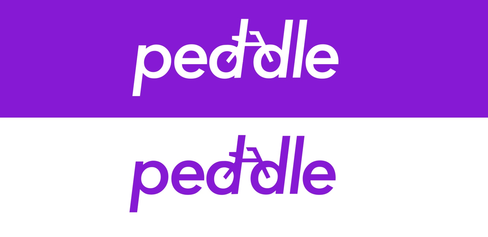

## Overview
**Peddle** is an open-collaborative app-development project tackling designing a marketplace for services. Think of instantly making an appointment for things like plumbing, simple electrical repair, car maintenance, home improvement, haircuts, cooking lessons, etc. 

**The business model?** Everyone works, everyone gets paid. Anyone who contributes to D&D, design and development, will co-own the project. Our aim is 100% payout to our partners, and 100% ownership of all developer’s designs and code for use wherever they want. 

**Is this a startup?** Maybe eventually. Right now, it is an open-collaborative, meaning it is still very much in concept and could take years before it becomes a functioning metaservice, but our first aim is to sell ads. 

**How can I get involved?** You can get in touch by sending me an email: ianweber30@icloud.com.

